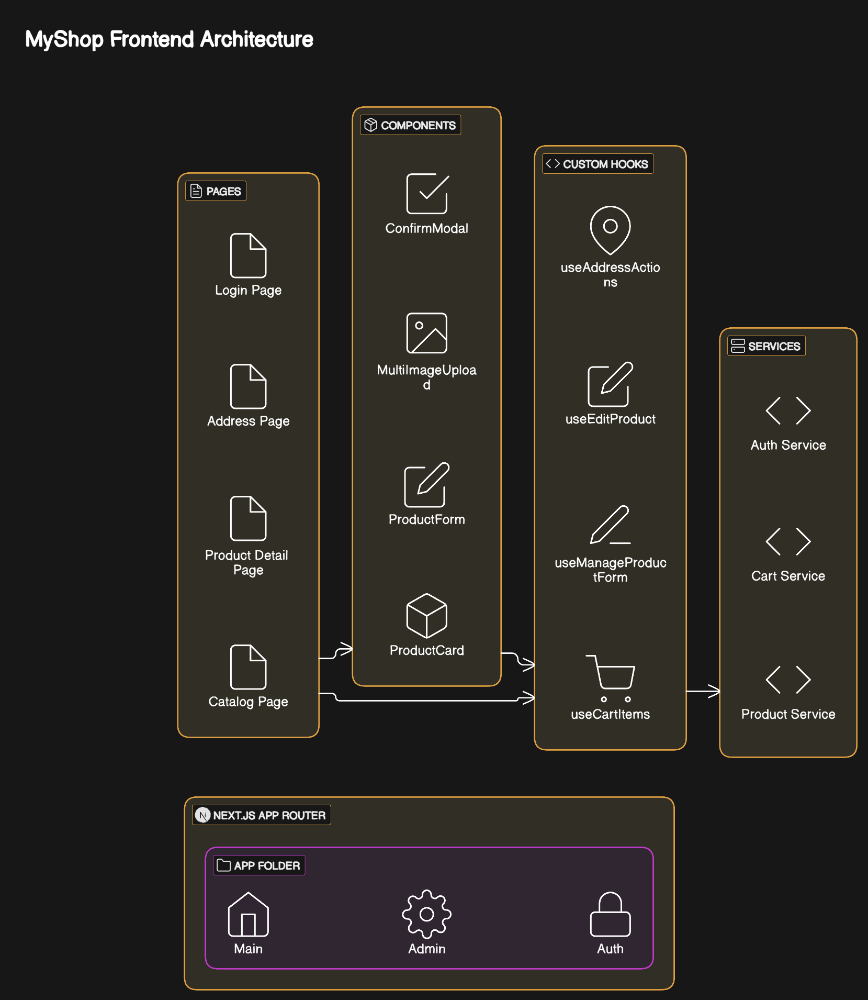
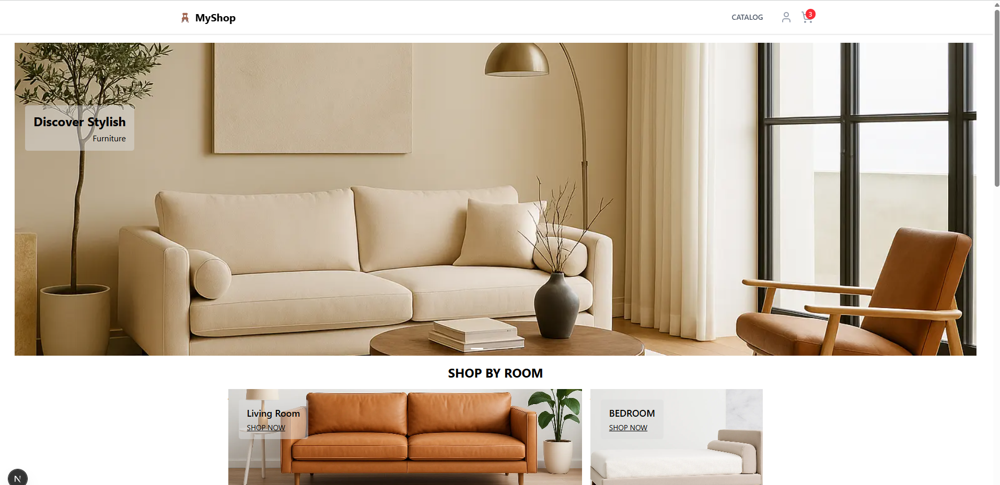
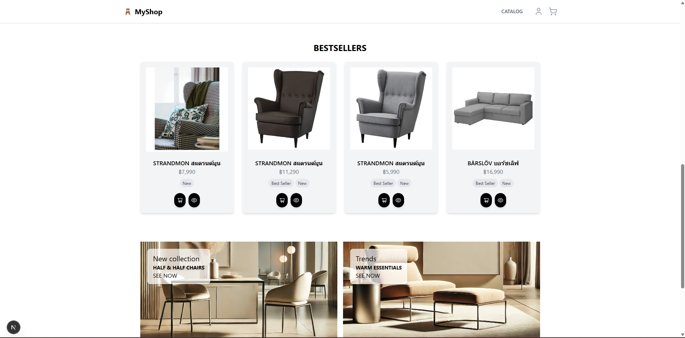
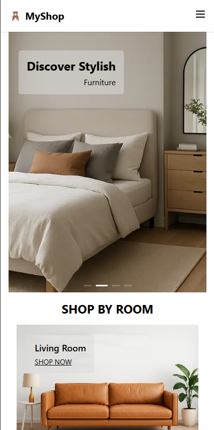
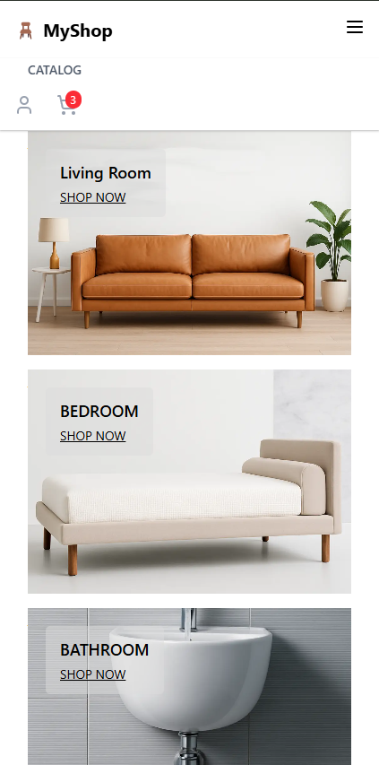
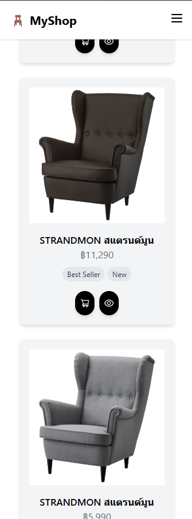
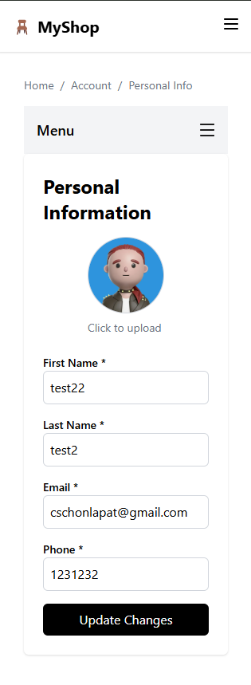
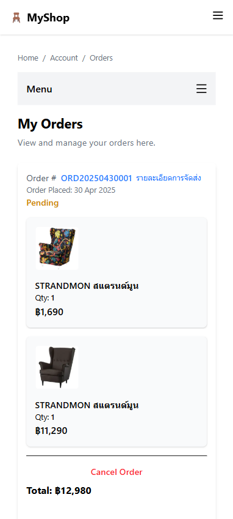

# 🪑 MyShop Frontend

This is the **frontend of MyShop**, built with [Next.js](https://nextjs.org), [Tailwind CSS](https://tailwindcss.com), and [TypeScript](https://www.typescriptlang.org/).  
It connects to a NestJS backend and displays product, cart, and member features.

---

## 🧩 Frontend Architecture Diagram



---

## 🌐 Web UI Preview

### 🖥 Desktop View



### 📱 Mobile View

| m1.png                                   | m2.png                                   | m3.png                                   |
| ---------------------------------------- | ---------------------------------------- | ---------------------------------------- |
|  |  |  |

| m4.png                                   | m5.png                                   |
| ---------------------------------------- | ---------------------------------------- |
|  |  |

---

## 🚀 Getting Started

### 1. Install dependencies

```bash
npm install
# or
yarn
```

### 2. Start development server

```bash
npm run dev
```

Visit [http://localhost:3000](http://localhost:3000) in your browser to see the result.

---

## 🧱 Project Structure

```
├── app/                         # Next.js App Router
│   └── (main)/catalog/         # Product catalog + product detail
│   └── (main)/account/         # Member address, payment
│   └── components/             # Reusable UI components
├── services/                   # API request handlers
├── hooks/                      # Custom React hooks
├── public/                     # Static files (images, etc.)
└── types/                      # TypeScript type definitions
```

---

## 🧠 Features

- ✅ Product catalog & detail pages
- 🛒 Shopping cart system
- 👤 Member info & address management
- 📱 Responsive design with Tailwind CSS

---

## 🛠 Tech Stack

- [x] Next.js (App Router)
- [x] TypeScript
- [x] Tailwind CSS
- [x] API connected to NestJS backend

---

## 🚀 Deployment

To deploy manually:

```bash
npm run build
npm run start
```
